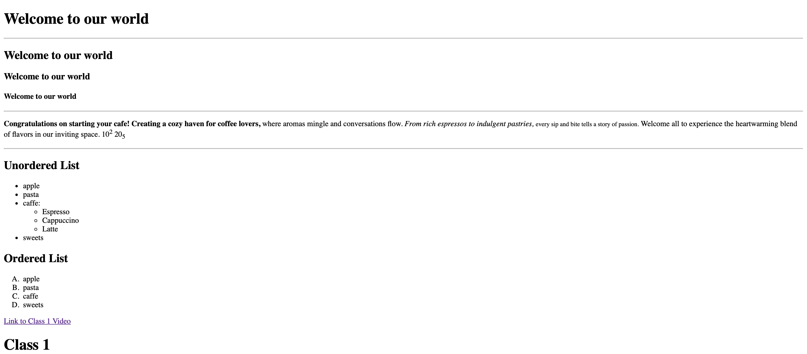

--Day1---

<html lang="en">
<head>
    <meta charset="UTF-8">
    <meta name="viewport" content="width=device-width, initial-scale=1.0">
    <title>ss of day1 project</title>
</head>

<body>
    <h1>This is day 1 project </h1>
    
    
</body>
</html>

<!--
1--Document Type Declaration: <!DOCTYPE html> indicates that the document is written in HTML5.

    2--<html> Tag: The root element of the HTML document.
3--<head> Section: Contains metadata about the document, such as the character encoding, viewport settings, and the title of the webpage.

    4--<body> Section: Contains the visible content of the webpage.
5--Headings: Various heading levels , h1 & h2  are used to define hierarchical headings.

    6--Horizontal Line: The 
 tag adds a horizontal line for visual separation.
7--Paragraph with Formatting: The 
 tag defines a paragraph. Within the paragraph, various tags like <b>, <i>, <small>, , and  are used to format text.

    8--Unordered List: The <ul> tag creates an unordered (bullet) list. Nested lists are also used within list items.
9--Ordered List: The =ol tag creates an ordered (numbered) list. The type="A" attribute is used to change the numbering style to uppercase letters.

    10--Hyperlink: The <a> tag creates a hyperlink. It links to a YouTube video and is placed within a paragraph. A separate <h1> heading is added.
--> 
