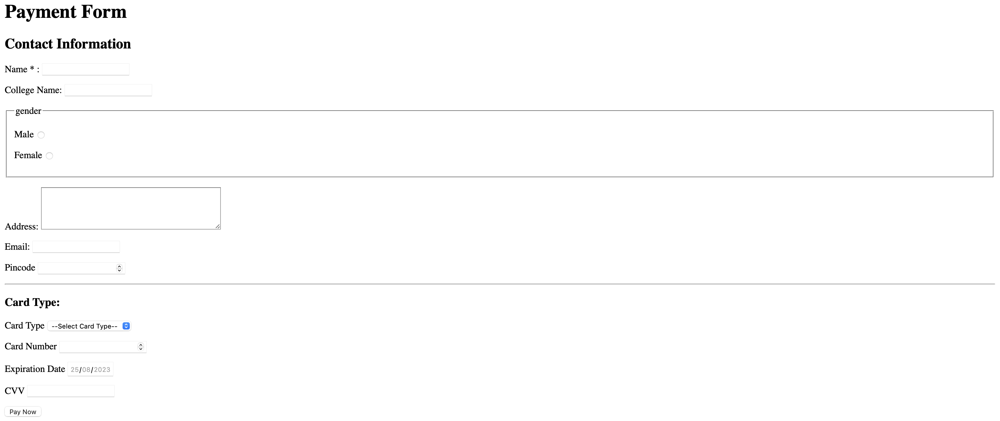

<html lang="en">
<head>
    <meta charset="UTF-8">
    <meta name="viewport" content="width=device-width, initial-scale=1.0">
    <title>ss of day3 project</title>
</head>

<body>
    <h1>This is day 3 project </h1>
    
    
</body>
</html>

web Form--

👉1--<form> Tag - Defining a Form:
The <form> tag defines an area in which user input is gathered. The action attribute specifies where the form data will be sent once it's submitted.
exp

    <form action="submit_page.php" method="POST">
    <!-- form elements go here -->
    </form>

        
👉2--<input> Tag - Input Fields:
The <input> tag is used to create various types of input fields. The type attribute determines the type of input field, such as text, password, radio, etc.
exp
       
    <input type="text" name="username" id="username">

👉3--name Attribute - Identifying Form Data:
The name attribute is used to uniquely identify form elements when the form is submitted. It's crucial for processing user input on the server.

    <input type="text" name="email" id="email">

👉4--id Attribute - Unique Element Identification:
The id attribute provides a unique identifier for an element. It's often used for targeting elements with CSS or JavaScript.

    <input type="password" name="password" id="password">

👉5--<fieldset> and <legend> Tags - Grouping Elements:
The <fieldset> tag groups related form elements together, and the <legend> tag provides a caption or title for the group.

    <fieldset>
    <legend>Contact Information</legend>
    <input type="text" name="name" id="name">
    <!-- more form elements -->
    </fieldset>

👉6--required Attribute - Making Fields Mandatory:
The required attribute makes a form field mandatory. Users must fill out this field before they can submit the form.
   
    <input type="text" name="name" id="name" required>

👉--Text Area - Multi-line Input:
The <textarea> tag creates a multi-line text input area. The cols and rows attributes define its dimensions.

    <textarea name="address" id="address" cols="30" rows="4"></textarea>
    
👉8--Email Input - Validating Email:
The type="email" attribute in an <input> tag helps browsers validate the entered text as an email address.

    <input type="email" name="email" id="email">
    
👉9--Number Input - Numeric Input:
The type="number" attribute creates an input field for numeric values. It may include additional attributes like min and max.

    <input type="number" name="age" id="age" min="0" max="120">
    
👉10--Dropdown Select - Selecting Options:
The <select> tag creates a dropdown menu. Each option is defined with an <option> tag. The value attribute specifies the value sent to the server.

    <select name="country" id="country">
    <option value="USA">United States</option>
    <option value="UK">United Kingdom</option>
    </select>

👉11--Date Input - Selecting Dates:
The type="date" attribute in an <input> tag provides a date picker for selecting dates.

    <input type="date" name="birthdate" id="birthdate">
    
👉12--Password Input - Secure Text Input:
The type="password" attribute in an <input> tag masks the entered text for security (e.g., passwords).

    <input type="password" name="password" id="password">

👉13--Submit Button - Form Submission:
The <input> tag with type="submit" creates a button that submits the form data to the server.

    <input type="submit" value="Submit">

