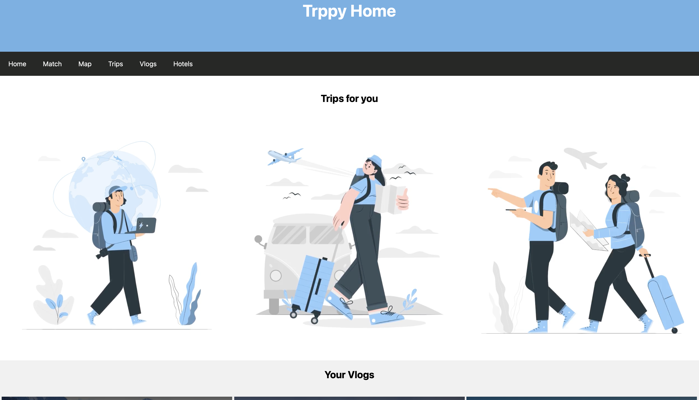
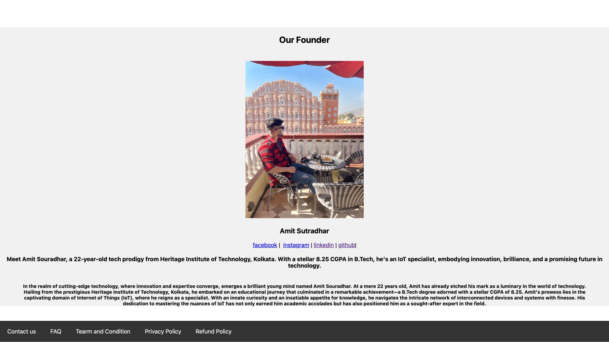

<html lang="en">
<head>
    <meta charset="UTF-8">
    <meta name="viewport" content="width=device-width, initial-scale=1.0">
    <title>ss of day3 project</title>
</head>

<body>
  
  <h1>This is day 3 project </h1>
  
    
  <h1>This is day 3 project </h1>
  

  <h1>This is day 3 project </h1>
  

  <h1>This is day 3 project </h1>
  

</body>
</html>
